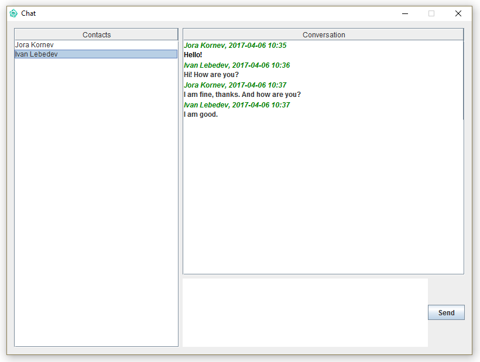

# CHAT #
***

#####Додаток для обміну текстовими повідомленнями.

Додаток базується на java sockets, JDBC, Postgres SQL,
Swing для графічного інтерфейсу та LOG4J як 
система логування.

На даний момент реалізована серверна частина та основні
елементи графічного інтерфейсу. Головне вікно додатку 
виглядає наступним чином

Для завершення проекту найближчим часом буде 
реалізований наступний функціонал:
* вдосконалення вікон логіну та регістрації;
* додана система нотифікації про нові повідомлення;
* упакувати базу даних в Docker контейнер;
* скріпти для збірки і запуску проекту.